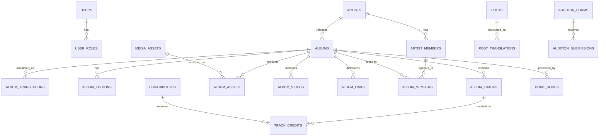

# THE MUZE 콘텐츠 데이터 모델 설계서

> 상태: 논리 설계 초안
>
> 목적: 웹사이트와 관리자 스튜디오가 같은 데이터를 원본으로 사용하도록, 아티스트·앨범·메인 슬라이드·공지·오디션의 관계를 정의한다. 이 문서는 SQL이나 특정 DBMS 구현이 아닌 데이터 구조와 운영 규칙을 다룬다.

## 1. 설계 목표

- 모든 공개 콘텐츠의 원본은 데이터베이스에 한 번만 저장한다.
- 앨범을 콘텐츠의 중심으로 두고, 메인 슬라이드·디스코그래피·앨범 상세가 같은 앨범 원본을 참조한다.
- 한국어를 기본으로 운영하되, 영어·일본어를 확장 가능한 번역 구조로 관리한다.
- 이미지·영상·음원·문서는 공통 미디어 라이브러리에서 재사용한다.
- 초안, 예약, 공개, 보관 상태와 수정 이력을 모든 주요 콘텐츠에 적용한다.
- 운영 권한과 오디션 개인정보를 공개 콘텐츠와 분리한다.

## 2. 핵심 원칙

### 2.1 원본 데이터는 중복하지 않는다

`앨범명`, `앨범 소개`, `아티스트명`, `Spotify 링크` 같은 정보는 앨범에만 저장한다. 메인 슬라이드는 해당 앨범을 선택하고 배치·기간·전용 비주얼만 관리한다.

### 2.2 다국어는 번역 테이블로 관리한다

`title_ko`, `title_en`, `title_ja` 식의 반복 컬럼 대신, 원본 엔터티와 번역 엔터티를 분리한다. 지원 언어가 늘어도 테이블 구조가 바뀌지 않는다.

### 2.3 URL이 아닌 미디어 자산을 참조한다

커버·로고·콘셉트 포토·티저 썸네일은 모두 `media_assets`를 참조한다. 파일 교체, ALT 텍스트, 파일 규격, 사용처 추적이 쉬워진다.

### 2.4 공개 상태는 두 조건을 만족해야 한다

연결된 콘텐츠는 본체와 노출 객체가 모두 공개 가능한 상태여야 한다. 예를 들어 메인 슬라이드는 앨범과 슬라이드 모두 `published`여야 표시된다.

## 3. 전체 관계



## 4. 공통 모델

### 4.1 공통 상태

주요 공개 콘텐츠는 아래 상태를 공통으로 사용한다.

| 상태 | 의미 |
|---|---|
| `draft` | 관리자에게만 보이는 작성 중 상태 |
| `scheduled` | 지정 시각에 공개될 예약 상태 |
| `published` | 공개 웹에 노출 가능한 상태 |
| `archived` | 운영 이력은 보관하되 웹에서는 숨긴 상태 |

각 엔터티에는 `created_at`, `updated_at`, `created_by`, `updated_by`, `published_at`을 둔다.

### 4.2 번역 구조

모든 번역 테이블은 아래 공통 규칙을 따른다.

| 필드 | 설명 |
|---|---|
| 부모 ID | 원본 엔터티 ID |
| `locale` | `ko`, `en`, `ja` 등 언어 코드 |
| 번역 필드 | 제목, 설명, 접근성 설명, SEO 문구 등 |

기본 노출 언어는 한국어다. 요청한 언어의 번역이 없으면 한국어를 보여 준다.

### 4.3 미디어 라이브러리: `media_assets`

| 필드 | 설명 |
|---|---|
| id | 내부 식별자 |
| storage_key | 스토리지 내 파일 경로 |
| public_url | 공개 URL 또는 전달 URL |
| asset_type | image / video / audio / document |
| mime_type, file_size | 파일 메타데이터 |
| width, height, duration_seconds | 렌더링·재생용 메타데이터 |
| alt_text | 기본 대체 텍스트 |
| uploaded_by | 업로드 관리자 |
| created_at | 업로드 시각 |

이미지는 사용 목적에 따라 ALT 텍스트를 달리할 수 있으므로, 앨범·게시물 연결 테이블에도 선택적 캡션을 둔다.

## 5. 계정과 권한

### 5.1 `users`

인증 계정의 운영 프로필이다. 이메일, 표시 이름, 마지막 로그인 시각을 둔다.

### 5.2 `roles` / `user_roles`

권한은 역할 기반으로 관리한다.

| 역할 | 범위 |
|---|---|
| `super_admin` | 계정·권한·모든 콘텐츠 관리 |
| `content_editor` | 아티스트, 앨범, 메인, 공지 편집·발행 |
| `audition_manager` | 오디션 지원서·평가만 접근 |
| `viewer` | 콘텐츠 조회만 가능 |

관리자 계정에만 메인 웹 헤더의 `STUDIO` 진입 항목을 표시한다.

### 5.3 `content_revisions`

발행 전후의 변경 이력을 저장한다.

| 필드 | 설명 |
|---|---|
| entity_type, entity_id | 변경 대상 |
| action | created / updated / published / archived |
| snapshot | 변경 시점의 데이터 스냅샷 |
| actor_id | 변경한 사용자 |
| created_at | 변경 시각 |

## 6. 아티스트와 멤버

### 6.1 `artists`

| 필드 | 설명 |
|---|---|
| id, slug | 내부 ID와 공개 URL 식별자 |
| artist_type | group / solo / project |
| debut_date | 데뷔일 |
| primary_color | 아티스트 대표 색상 |
| profile_asset_id | 대표 이미지 |
| status, sort_order | 공개 상태와 목록 순서 |

### 6.2 `artist_translations`

아티스트명, 소개, SEO 제목·설명을 다국어로 관리한다.

### 6.3 `artist_members`

| 필드 | 설명 |
|---|---|
| artist_id | 소속 아티스트 |
| slug | 공개 프로필 URL 식별자 |
| birth_date, mbti | 프로필 기본 정보 |
| profile_asset_id | 대표 프로필 이미지 |
| status, sort_order | 공개 상태와 노출 순서 |

### 6.4 `artist_member_translations`

예명, 포지션, 소개글을 언어별로 관리한다.

## 7. 앨범 도메인

앨범은 공개 콘텐츠의 핵심 단위다. 싱글, 미니 앨범, 정규 앨범, OST, 선공개 싱글 등을 모두 앨범 도메인에서 처리한다.

### 7.1 `albums`: 앨범 본체

| 필드 | 설명 |
|---|---|
| id, artist_id, slug | 앨범 식별과 발매 아티스트 |
| album_type | single / digital_single / mini_album / full_album / ost / pre_release / collaboration |
| release_date, release_time, timezone | 공식 발매 시점 |
| cover_asset_id | 대표 커버 |
| logo_asset_id | 대표 앨범 타이틀 로고 |
| accent_color | 앨범별 공개 페이지 테마 색상 |
| is_featured | 대표 발매 여부 |
| status, published_at, sort_order | 발행·정렬 정보 |

### 7.2 `album_translations`

| 필드 | 설명 |
|---|---|
| album_id, locale | 앨범 및 언어 |
| title | 앨범명 |
| subtitle | 예: `RESCENE 3rd Mini Album` |
| description | 공개 웹용 소개 |
| press_description | 긴 보도자료용 소개 |
| seo_title, seo_description | 검색 노출 정보 |

### 7.3 `album_editions`: 앨범 버전

동일 앨범의 디지털·일반반·플랫폼 앨범·일본판 등을 분리한다.

| 필드 | 설명 |
|---|---|
| album_id | 원본 앨범 |
| edition_name | 버전명 |
| format | digital / cd / vinyl / platform / kit |
| cover_asset_id | 버전별 커버 |
| catalog_number, barcode | 제작·유통 번호 |
| release_date | 버전별 출시일 |
| is_primary | 대표 버전 여부 |
| availability_status | 판매중 / 품절 / 종료 |

### 7.4 `album_tracks`: 수록곡

| 필드 | 설명 |
|---|---|
| album_id | 소속 앨범 |
| disc_number, track_number | CD·트랙 순서 |
| duration_seconds | 재생 시간 |
| is_title_track | 타이틀곡 여부 |
| is_pre_release | 선공개곡 여부 |
| is_instrumental | Inst. 여부 |
| audio_preview_asset_id | 선택적 음원 프리뷰 |
| status, sort_order | 공개 여부와 정렬 |

`track_translations`에서 곡명, 가사 소개 등을 언어별로 관리한다.

### 7.5 `contributors` / `track_credits`: 곡 크레딧

`contributors`는 참여자 인명 정보, `track_credits`는 어떤 곡에 어떤 역할로 참여했는지를 관리한다.

| `track_credits` 필드 | 설명 |
|---|---|
| track_id, contributor_id | 곡과 참여자 |
| credit_role | lyrics / composition / arrangement / featuring / mixing / mastering 등 |
| sort_order | 크레딧 표기 순서 |

### 7.6 `album_members`: 앨범 참여 멤버

그룹 전체 멤버와 이번 앨범에 노출·참여할 멤버를 분리한다.

| 필드 | 설명 |
|---|---|
| album_id, member_id | 앨범과 멤버 |
| participation_type | member / featured_artist / unit |
| concept_asset_id | 앨범별 멤버 콘셉트 이미지 |
| sort_order | 앨범 상세 노출 순서 |

### 7.7 `album_assets`: 앨범 이미지와 로고

| 필드 | 설명 |
|---|---|
| album_id, media_asset_id | 앨범과 미디어 |
| asset_role | cover / album_logo / concept / gallery / jacket / teaser_thumbnail |
| variant | primary / light / dark / symbol |
| caption | 이미지 설명 |
| is_primary, sort_order | 대표 여부와 정렬 |

앨범 로고는 투명 PNG와 SVG를 함께 운영하는 것을 권장한다. 밝은 배경용과 어두운 배경용 버전을 구분하면 메인·상세 화면에서 가독성을 유지할 수 있다.

### 7.8 `album_videos`: YouTube 중심 영상

| 필드 | 설명 |
|---|---|
| album_id | 소속 앨범 |
| track_id | 특정 곡 영상일 경우 연결 |
| video_type | music_video / teaser / performance / dance_practice / live_clip / behind / highlight_medley |
| youtube_url, youtube_video_id | YouTube 연결 정보 |
| thumbnail_asset_id | 커스텀 썸네일 |
| title | 영상 제목 |
| is_primary | 대표 MV 여부 |
| published_at, sort_order, status | 공개·정렬 정보 |

대표 MV는 `video_type = music_video`이면서 `is_primary = true`인 항목이다.

### 7.9 `album_links`: 스트리밍·구매 연결

| 필드 | 설명 |
|---|---|
| album_id | 앨범 연결 |
| track_id | 특정 곡 링크일 경우 연결 |
| edition_id | 특정 실물 버전 링크일 경우 연결 |
| platform | spotify / apple_music / youtube_music / melon / genie / bugs / weverse / shop 등 |
| link_type | streaming / purchase / pre_save |
| url, region | 연결 주소와 지역 |
| is_active, sort_order | 노출 여부와 순서 |

## 8. 메인 슬라이드

### 8.1 핵심 원칙

메인 슬라이드는 앨범 데이터 기반이다. 제목, 아티스트, 소개, 색상, 스트리밍 링크, 대표 MV를 다시 입력하지 않는다.

### 8.2 `home_slides`

| 필드 | 설명 |
|---|---|
| album_id | 홍보할 앨범 |
| visual_asset_id | 슬라이드 전용 비주얼. 없으면 앨범 대표 커버 또는 콘셉트 이미지 사용 |
| logo_asset_id | 슬라이드 전용 로고. 없으면 앨범 대표 로고 사용 |
| featured_video_id | 대표 MV를 직접 지정해야 할 때 |
| cta_type | album_detail / music_video / streaming / external_url |
| cta_label | 버튼 문구 |
| cta_url_override | 외부 캠페인 링크가 필요할 때만 사용 |
| headline_override, description_override | 앨범 원문 대신 캠페인용 카피가 필요할 때만 사용 |
| sort_order, is_pinned | 순서와 고정 여부 |
| start_at, end_at | 자동 노출 기간 |
| status | 초안 / 예약 / 공개 / 보관 |

### 8.3 슬라이드가 앨범에서 자동으로 읽는 정보

| 메인 요소 | 원본 |
|---|---|
| 아티스트명 | artist + artist_translation |
| 앨범명·소개 | album_translation |
| 앨범 종류·발매일·색상 | albums |
| 앨범 로고 | album_assets |
| 스트리밍 링크 | album_links |
| 대표 MV | album_videos |

### 8.4 공개 규칙

- 앨범과 슬라이드가 모두 `published`여야 한다.
- 예약 시 현재 시간이 `start_at` 이후여야 한다.
- `end_at` 이후에는 자동으로 숨긴다.
- 앨범이 `archived`가 되면 연결 슬라이드도 자동 비노출한다.

## 9. 공지·뉴스

### 9.1 `posts`

공지, 보도자료, 이벤트, 법적 안내를 하나의 게시물 모델로 관리한다.

| 필드 | 설명 |
|---|---|
| slug, post_type | URL과 게시물 유형 |
| post_type | notice / news / event / legal / press |
| thumbnail_asset_id | 대표 이미지 |
| author_id | 작성자 |
| status, published_at | 발행 제어 |

`post_translations`는 제목, 요약, 본문, SEO 정보를 언어별로 저장한다.

## 10. 일반 페이지 콘텐츠

### 10.1 `site_pages`

회사 소개, 히스토리 등 고정 페이지의 상태와 SEO 설정을 관리한다.

### 10.2 `page_sections` / `page_section_translations`

페이지를 섹션 단위로 구성한다. 예를 들어 회사 소개는 브랜드 소개, 비전, 연혁, 주요 공지 섹션으로 나눈다. 반복 구조가 필요한 요소만 설정 데이터로 두고, 핵심 텍스트는 번역 테이블에 저장한다.

## 11. 오디션

오디션 지원자 개인정보는 공개 콘텐츠 데이터와 분리한다.

| 테이블 | 역할 |
|---|---|
| `audition_forms` | 모집 폼과 공개 상태 |
| `audition_submissions` | 지원 상태와 담당자 배정 |
| `audition_applicants` | 이름, 연락처, 생년월일 등 개인정보 |
| `audition_materials` | 영상·사진·외부 포트폴리오 링크 |
| `audition_notes` | 내부 평가 메모 |
| `audition_status_history` | 상태 변경 이력 |

오디션 정보는 `audition_manager` 이상만 열람한다. 개인정보 보존 기간·파기 정책도 별도로 설정한다.

## 12. 앨범 상세 화면의 조회 단위

앨범 상세 페이지는 아래 데이터를 하나의 화면 모델로 구성한다.

```text
아티스트
  └─ 앨범
      ├─ 다국어 제목·소개·앨범 로고·커버·발매일
      ├─ 앨범 버전
      ├─ 참여 멤버와 멤버별 콘셉트 이미지
      ├─ 수록곡
      │   └─ 곡별 크레딧·음원 링크·MV
      ├─ 공식 MV·티저·안무·비하인드 영상
      ├─ 콘셉트 포토·갤러리
      └─ 스트리밍·구매 링크
```

## 13. 관리자 화면 구조

관리자 계정에만 메인 웹 헤더의 `STUDIO` 진입 버튼을 표시한다. 별도의 공개 관리자 링크는 노출하지 않는다.

관리자 메뉴는 아래 흐름을 따른다.

1. 콘텐츠 현황
2. 메인 비주얼
3. 공지·뉴스
4. 아티스트 관리
   - 아티스트 정보
   - 멤버
   - 디스코그래피
   - 트랙리스트
5. 오디션 관리

앨범 편집 화면은 다음 순서가 적합하다.

1. 기본 정보와 발행 설정
2. 한국어·영어·일본어 정보
3. 커버·앨범 로고·콘셉트 이미지
4. 수록곡과 크레딧
5. 참여 멤버
6. MV·티저·안무 영상
7. 스트리밍·구매 링크
8. 앨범 버전
9. 메인 슬라이드 노출 설정

## 14. 구현 우선순위

1. 사용자·권한, 미디어 라이브러리
2. 아티스트·멤버
3. 앨범, 앨범 번역, 수록곡, 앨범 링크
4. 앨범 로고·이미지·YouTube 영상·크레딧
5. 앨범 기반 메인 슬라이드
6. 공지·뉴스, 일반 페이지
7. 오디션 분리·권한·보존 정책

이 순서라면 앨범 등록부터 메인 노출, 디스코그래피와 앨범 상세 반영까지 먼저 완성할 수 있다.
