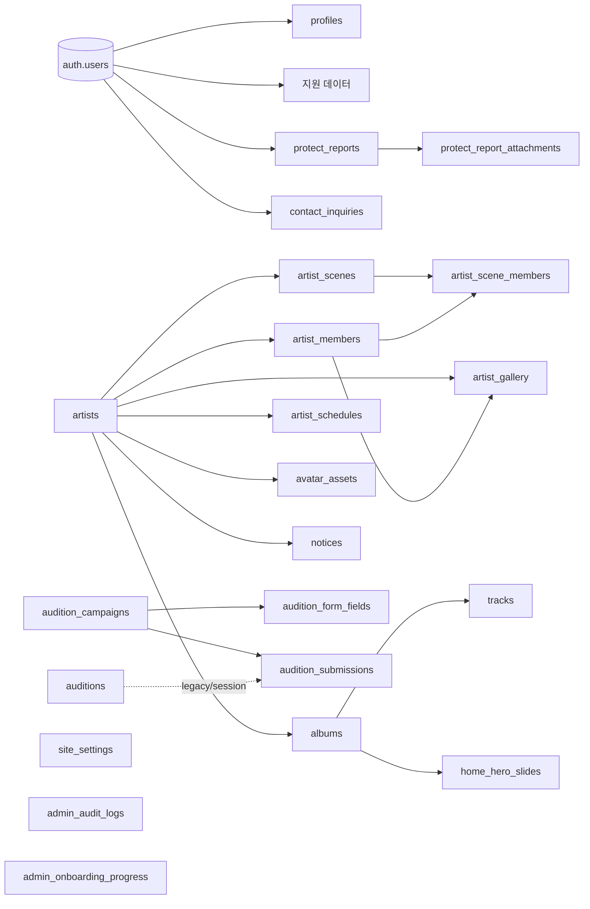

# THE MUZE 데이터베이스 스키마와 구조

> 기준일: 2026-08-10  
> 기준: `supabase/migrations/` 전체와 `supabase/schema.remote.sql` 스냅샷

이 문서는 현재 애플리케이션이 사용하는 데이터 경계를 빠르게 이해하기 위한 지도다. 정확한 DDL과 제약조건은 migration을 기준으로 확인한다.

## 기준 우선순위

1. `supabase/migrations/*.sql`: 변경 이력과 배포해야 할 정본
2. 연결된 프로젝트: `npm run db:status` 결과
3. `supabase/schema.remote.sql`: `npm run db:dump`로 생성한 원격 스냅샷
4. 이 문서: 사람이 읽는 구조 요약

`schema.remote.sql`을 직접 수정하지 않는다. 최신 migration이 스냅샷에 아직 반영되지 않을 수 있으므로 운영 스키마를 판단할 때는 `db:status`를 먼저 확인한다.

## 전체 구조



## 도메인별 테이블

### 1. 아티스트와 공개 콘텐츠

| 테이블 | 역할 | 주요 관계 |
| --- | --- | --- |
| `artists` | 아티스트 본체, slug, 이름, 설명, 로고, 활성 상태 | 루트 |
| `artist_members` | 멤버 프로필과 다국어 이름 | `artist_id → artists` |
| `artist_gallery` | 아티스트·멤버·앨범에 연결되는 이미지 | `artist_id`, 선택적 `member_id`, `album_id` |
| `artist_scenes` | 아티스트 scene 이미지와 hero/공개 상태 | `artist_id → artists` |
| `artist_scene_members` | scene 안 멤버 배치/순서 | `scene_id`, `member_id` |
| `artist_schedules` | 아티스트 일정과 다국어 제목/설명 | `artist_id → artists` |
| `notices` | 전역 또는 아티스트별 공지 | 선택적 `artist_id → artists` |
| `avatar_assets` | 관리자·계정에서 선택하는 아티스트 avatar 이미지 | `artist_id → artists` |

공개 조회는 대체로 `is_active`, `is_published`, `published_at`, 현재 날짜 같은 공개 조건과 RLS를 함께 통과해야 한다. `artists` 삭제는 하위 공개 콘텐츠에 cascade가 적용되므로 운영에서 삭제보다 비활성화를 우선한다.

### 2. 앨범과 음악

| 테이블 | 역할 | 주요 관계 |
| --- | --- | --- |
| `albums` | 앨범, 발매일, 커버/hero URL, 공개 상태, 정렬 | `artist_id → artists`, `(artist_id, slug)` unique |
| `tracks` | 수록곡, 트랙 번호, 재생/외부 링크, title flag | `album_id → albums` cascade |
| `home_hero_slides` | 홈 hero에 노출할 앨범 순서와 활성 상태 | `album_id → albums` cascade |

앨범 저장은 `save_album_with_tracks()` RPC를 사용할 수 있다. 곡 순서 조회는 `tracks_album_order_idx`, 공개 앨범 목록은 `albums_public_order_idx`를 사용한다.

### 3. 계정과 관리자

| 테이블 | 역할 | 주요 관계 |
| --- | --- | --- |
| `profiles` | `auth.users`의 앱 프로필, email, 이름, 관리자 role | `id → auth.users`, role은 `editor`/`super_admin`/null |
| `admin_onboarding_progress` | 관리자별 onboarding chapter 진행 상태 | `user_id → auth.users`, `(user_id, chapter_id)` PK |
| `admin_audit_logs` | 관리자 변경 이력, 대상 테이블/row, 민감도 | actor는 `auth.users`를 가리키지만 운영 이력 보존이 우선 |

새 사용자의 profile은 DB trigger로 생성된다. role은 일반 사용자의 자기 수정 대상이 아니며, 관리자 계정 변경은 `super_admin` 경계를 통과해야 한다.

### 4. 오디션

현재 새 흐름은 `audition_campaigns` 모델이다. `auditions`는 이전 session/form 구조와 호환하기 위한 테이블로 남아 있다.

| 테이블 | 역할 | 주요 관계 |
| --- | --- | --- |
| `audition_campaigns` | 공개 지원 캠페인 기간·활성·다국어 설명 | `created_by → auth.users` |
| `audition_form_fields` | 캠페인별 동적 질문, type, options, 파일 제한 | `campaign_id → audition_campaigns` cascade |
| `audition_submissions` | 지원 답변과 제출 시점 form snapshot, 심사 상태 | `campaign_id` restrict, 선택적 `user_id`, legacy `audition_id` |
| `auditions` | legacy/session 기반 오디션, JSON form schema | `audition_submissions.audition_id`에서 선택 참조 |

제출 데이터의 핵심 규칙:

- `answers`는 field key 기반 JSONB이고 `form_snapshot`은 제출 당시 질문을 보존한다.
- 지원 이메일 원문은 중복 확인용으로 저장하지 않고 `applicant_email_hash`를 사용한다.
- `(campaign_id, applicant_email_hash)`와 `(campaign_id, user_id)`는 부분 unique index로 중복 제출을 막는다.
- 사용자는 `get_my_audition_submissions()` projection만 사용하고, 관리자는 `get_admin_audition_submissions()`로 심사 데이터를 읽는다.

### 5. 문의와 Protect

| 테이블 | 역할 | 공개/소유 범위 |
| --- | --- | --- |
| `contact_inquiries` | general/business 문의, 첨부, 답변 상태 | 생성은 서버 route, 조회·수정은 관리자 |
| `protect_reports` | 로그인 사용자의 권리침해 신고 | 작성자 본인 또는 관리자 |
| `protect_report_attachments` | 신고 증빙 파일 metadata | 신고 소유자 또는 관리자 |

문의의 `privacy_consent`와 Protect의 `confirmation`은 DB check constraint로 true를 강제한다. 첨부파일 metadata가 DB row와 Storage object에서 불일치하지 않도록 서버 검증과 trigger를 함께 사용한다.

### 6. 전역 설정

`site_settings`는 `key text + value jsonb` 구조다. social 값은 배열이어야 하며, 설정 key의 의미와 JSON shape는 [설정 editor model](../../src/admin/pages/settings/settings-editor-model.ts)을 기준으로 한다.

## 인증·권한 구조

```text
auth.users
  └─ profiles.role
       ├─ null          일반 사용자
       ├─ editor        콘텐츠/운영 편집
       └─ super_admin   관리자 계정과 role 변경 포함
```

- public/anon: 활성·공개 조건을 만족한 콘텐츠만 읽는다.
- authenticated: 자기 profile, 자기 audition submission, 자기 Protect 데이터만 읽는 영역이 있다.
- admin: `public.is_admin()` 정책으로 콘텐츠·문의·신고·오디션을 관리한다.
- super admin: profile과 관리자 role 변경 같은 더 민감한 작업을 수행한다.
- service role: 서버 route의 제한된 작업에서만 사용하며 브라우저에 노출하지 않는다.

모든 public 테이블은 RLS가 활성화되어 있다. policy 변경은 애플리케이션 테스트만으로 충분하지 않으므로 `supabase/tests/` SQL 테스트를 같이 갱신한다.

## Storage 구조

| Bucket | 공개 여부 | 용도 | 주요 제한 |
| --- | --- | --- | --- |
| `artist-assets` | 공개 | 아티스트 이미지·로고 | 관리자 업로드, 서버 파일 signature 검증 |
| `album-covers` | 공개 | 앨범 커버 | 관리자 업로드, 이미지 검증 |
| `track-assets` | 공개 | 트랙 커버·오디오 | 관리자 업로드, 서버 검증 |
| `business-assets` | 공개 | `press-kit.zip`, `profile.pdf` | 관리자와 고정 파일명만 허용 |
| `contact-attachments` | 비공개 | 문의 첨부 | 현재 PDF 중심, 관리자 route를 통해 접근 |
| `protect-evidence` | 비공개 | Protect 증빙 | 신고 소유자·관리자만 접근 |
| `audition-attachments` | 비공개 | 오디션 지원 첨부 | 제출 API와 관리자만 접근 |

브라우저가 임의 Storage path를 직접 결정하지 않는다. 서버가 bucket, path, 파일 크기, 실제 signature, 확장자를 검증하고 DB row와 연결한다. 실패 시 생성된 object는 route에서 best-effort cleanup한다.

## RPC·트리거·운영 경계

주요 RPC:

- 권한: `is_admin()`, `is_super_admin()`, `has_admin_role()`
- rate limit: `consume_login_rate_limit()`, `reset_login_rate_limit()`, `consume_submission_rate_limit()`
- 오디션 projection: `get_my_audition_submissions()`, `get_admin_audition_submissions()`
- 원자 저장: `save_album_with_tracks()`, `save_avatar_assets()`, `reorder_albums()`

주요 trigger:

- `set_updated_at()`로 수정 시각 갱신
- `capture_admin_audit()`로 관리자 변경 이력 기록
- 신규 auth user의 profile 생성
- 비활성 avatar를 profile에서 제거
- 문의 첨부 size를 Storage metadata에서 보정

## Migration 작업 순서

```powershell
npm run db:status
npx supabase migration new meaningful_name
npm run db:push
npm run db:dump
npm run db:test
```

규칙:

1. 이미 적용한 migration은 수정하지 않고 새 timestamp migration을 추가한다.
2. destructive 변경은 백업·복구 SQL과 함께 배포 순서를 기록한다.
3. RLS, grant/revoke, policy, security-definer 함수의 `search_path`를 같은 migration에서 검토한다.
4. public 노출이나 민감 데이터 변경이면 `supabase/tests/`에 권한 경계 테스트를 추가한다.
5. 앱이 기대하는 column/함수보다 migration을 먼저 적용하고, 제거는 호환 기간 뒤에 별도 migration으로 한다.

현재 migration 최신 파일은 `20260810050000_allow_admin_delete_audition_submissions.sql`이다. 원격 적용 여부는 파일명만으로 추정하지 말고 `npm run db:status`로 확인한다.
